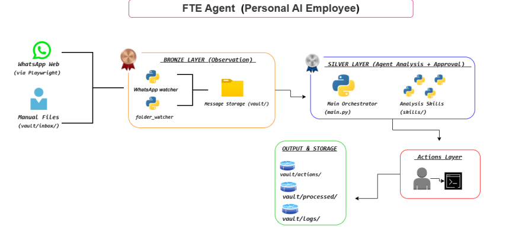

# Autonomous FTE AI Employee

A sophisticated Personal AI Employee system that autonomously manages incoming messages through intelligent observation, analysis, and action execution with human oversight.

## 🎯 Overview

This project implements a **Full-Time Employee (FTE) AI Agent** that acts as your personal assistant, monitoring communication channels (WhatsApp, files), analyzing messages, and suggesting intelligent actions with human approval.

## 🏗️ Architecture

The system is built with a layered architecture:



### System Layers

**Bronze Layer (Observation)**
- Monitors WhatsApp Web and file system for new messages
- Stores all incoming messages without modification
- Provides audit trail of all communications

**Silver Layer (Agent Analysis)**
- AI-powered analysis using OpenRouter API
- Intelligent skills: summarization, priority detection, categorization, reply suggestion, task extraction
- Human-in-the-loop approval for all actions
- Structured output with actionable insights

**Action Execution Layer**
- Creates reply drafts (never auto-sends)
- Generates task files from extracted action items
- Complete audit logging of all operations

## ✨ Key Features

- **🤖 AI-Powered Analysis**: Uses OpenRouter API with advanced language models
- **📱 WhatsApp Integration**: Monitors WhatsApp Web for real-time message processing
- **🎯 Smart Categorization**: Automatically categorizes messages (work/personal/study/finance)
- **⚡ Priority Detection**: Identifies HIGH/MEDIUM/LOW priority messages
- **💬 Reply Suggestions**: Context-aware reply generation
- **✅ Task Extraction**: Automatically identifies actionable tasks
- **👤 Human Approval**: All actions require explicit user consent
- **📊 Audit Trail**: Complete logging of all operations
- **🔒 Secure**: API keys protected, no auto-execution

## 🚀 Quick Start

### Prerequisites

- Python 3.12+
- OpenRouter API key (get free key at https://openrouter.ai/keys)

### Installation

1. Clone the repository:
```bash
git clone https://github.com/yourusername/autonomous-fte-ai-employee.git
cd autonomous-fte-ai-employee/FTE_Project
```

2. Install dependencies:
```bash
pip install -r requirements.txt
```

3. Configure API key:
```bash
cp .env.example .env
# Edit .env and add your OPENROUTER_API_KEY
```

4. Run the system:
```bash
# Interactive mode
python main.py

# WhatsApp monitoring mode
python main.py --whatsapp

# Folder watcher mode
python main.py --watch

# Demo mode
python main.py --demo
```

## 📁 Project Structure

```
autonomous-fte-ai-employee/
└── FTE_Project/
    ├── main.py                    # Entry point
    ├── .env.example               # Environment template
    ├── requirements.txt           # Dependencies
    │
    ├── agent/                     # AI Agent Brain
    │   ├── brain.py              # OpenRouter integration
    │   ├── tools.py              # Skill registration
    │   └── prompts.py            # System prompts
    │
    ├── skills/                    # Analysis Skills
    │   ├── summarizer.py         # Content summarization
    │   ├── reply_suggester.py    # Reply generation
    │   ├── task_extractor.py     # Task identification
    │   ├── priority_detector.py  # Priority classification
    │   └── categorizer.py        # Message categorization
    │
    ├── watchers/                  # Input Monitors
    │   └── whatsapp_watcher.py   # WhatsApp Web integration
    │
    ├── config/                    # Configuration
    │   └── settings.py           # Centralized settings
    │
    └── vault/                     # Data Storage
        ├── inbox/                # Incoming messages
        ├── processed/            # Completed messages
        ├── actions/              # Action outputs
        └── logs/                 # Audit logs
```

## 🔄 Workflow

1. **Message Arrives** → WhatsApp or file system
2. **Bronze Layer** → Observes and stores message
3. **Silver Layer** → AI analyzes with 5 skills
4. **Display Results** → Shows summary, priority, category, suggestions, tasks
5. **Human Approval** → User approves/rejects each action
6. **Execute Actions** → Creates drafts and task files
7. **Audit Log** → Records all operations
8. **Cleanup** → Moves message to processed folder

## 🎯 Use Cases

- **Email/Message Management**: Auto-categorize and prioritize incoming messages
- **Task Management**: Extract actionable items from communications
- **Reply Assistance**: Get context-aware reply suggestions
- **Priority Filtering**: Focus on high-priority messages first
- **Audit Trail**: Complete record of all message handling

## 🔒 Security

- ✅ API keys stored in `.env` (never committed to git)
- ✅ `.gitignore` configured to exclude sensitive files
- ✅ No automatic message sending (drafts only)
- ✅ Human approval required for all actions
- ✅ Complete audit logging

## 📊 Example Output

```
==============================================================
  AGENT ANALYSIS
==============================================================

[FROM] Sarah
[PRIORITY] HIGH
[CATEGORY] WORK

[SUMMARY]
Need help with quarterly budget report. Review spreadsheet
and provide feedback by tomorrow 2 PM. Board meeting Friday.

[SUGGESTED REPLY]
Hi Sarah, I'll review the budget report today and send you
my feedback by tomorrow 1 PM. I'll also coordinate with the
finance team for the follow-up meeting.

[EXTRACTED TASKS]
  1. Review quarterly budget spreadsheet
  2. Send feedback by tomorrow 2 PM
  3. Schedule meeting with finance team

==============================================================

[ACTION 1] Send suggested reply
  Approve this action? [Y/n]: y
  -> APPROVED ✓

[ACTION 2] Create task: Review quarterly budget spreadsheet
  Approve this action? [Y/n]: y
  -> APPROVED ✓
```

## 🛠️ Configuration

Edit `FTE_Project/.env`:

```bash
# OpenRouter API Configuration
OPENROUTER_API_KEY=your_key_here
OPENROUTER_MODEL=mistralai/mistral-7b-instruct

# Application Settings
APP_NAME=FTE_Agent
LOG_LEVEL=INFO

# Vault Paths
VAULT_INBOX=vault/inbox
VAULT_PROCESSED=vault/processed
VAULT_ACTIONS=vault/actions
VAULT_LOGS=vault/logs
```

## 📚 Documentation

- [Full README](FTE_Project/README.md) - Detailed project documentation
- [Architecture Guide](FTE_Project/ARCHITECTURE.md) - System architecture details
- [Architecture Diagram](FTE_Project/FTE_Project_Architecture.png) - Visual system overview

## 🤝 Contributing

This is a hackathon project demonstrating autonomous AI agent capabilities. Feel free to fork and extend!

## 📝 License

MIT License - See LICENSE file for details

## 🎓 Hackathon

Built for **Hackathon 0 - Personal AI Employee (FTE)**

**Requirements Met:**
- ✅ Bronze Level: Observation and storage
- ✅ Silver Level: AI analysis with human approval
- ✅ Agent Architecture: OpenRouter integration with tool calling
- ✅ Skills System: 5 independent analysis skills
- ✅ Human-in-the-Loop: Approval required for all actions
- ✅ Audit Trail: Complete logging

---

**Built with ❤️ using OpenRouter API and Python**
